# Microsoft 365 Administration Lab

A hands-on Microsoft 365 administration lab designed to simulate real-world IT support and system administration tasks. This project demonstrates practical experience administering Microsoft 365 services including Microsoft Entra ID (Azure AD), Exchange Online, SharePoint Online, OneDrive, Microsoft Intune, Microsoft Defender, Multi-Factor Authentication (MFA), Conditional Access, and user lifecycle management.

---

## Project Overview

This lab was built to gain hands-on experience performing common Microsoft 365 administration tasks found in enterprise IT environments.

The environment simulates a small business called **MullenTech Solutions**, where users, groups, security policies, collaboration tools, and device management were configured using Microsoft 365 Business Premium.

---

## Technologies Used

- Microsoft 365 Admin Center
- Microsoft Entra ID (Azure AD)
- Microsoft Exchange Online
- Microsoft Intune
- Microsoft SharePoint Online
- Microsoft OneDrive
- Microsoft Defender
- Microsoft Teams
- Multi-Factor Authentication (MFA)
- Conditional Access
- Windows 11

---

## Skills Demonstrated

### Identity & Access Management
- Created and managed Microsoft Entra ID (Azure AD) user accounts
- Assigned Microsoft 365 Business Premium licenses
- Created and managed Security Groups and Microsoft 365 Groups
- Configured Multi-Factor Authentication (MFA)
- Implemented Conditional Access policies
- Performed user password resets
- Completed user offboarding by blocking sign-in, removing licenses, and removing group memberships

### Exchange Online Administration
- Created shared mailboxes
- Configured mailbox permissions
- Created and managed distribution groups
- Managed user mailboxes and licensing

### SharePoint & OneDrive Administration
- Created a SharePoint Team Site
- Configured document library permissions
- Managed file sharing using OneDrive
- Configured user access to organizational resources

### Microsoft Intune
- Created device compliance policies
- Created Windows configuration profiles
- Assigned policies to device security groups
- Configured Windows security baseline settings

### Security
- Configured Microsoft Security Defaults
- Created Conditional Access policies requiring Multi-Factor Authentication

---

# Project Walkthrough

## 1. Microsoft 365 Tenant Administration

Created and configured a Microsoft 365 Business Premium tenant for a simulated organization (MullenTech Solutions). The tenant served as the centralized environment for identity management, messaging, collaboration, security, and endpoint management.

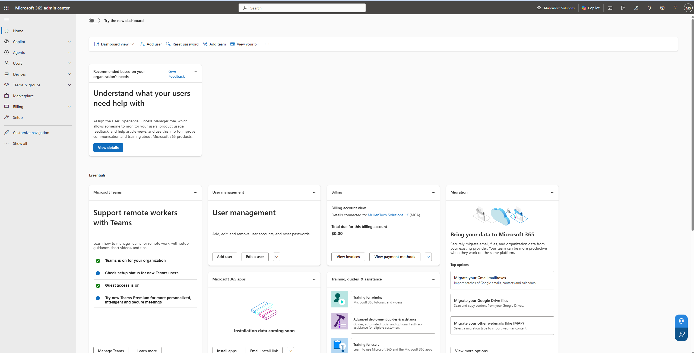

---

## 2. User Provisioning & License Management

Created employee accounts, assigned Microsoft 365 Business Premium licenses, and configured user profiles to simulate onboarding new employees.

### Active Users

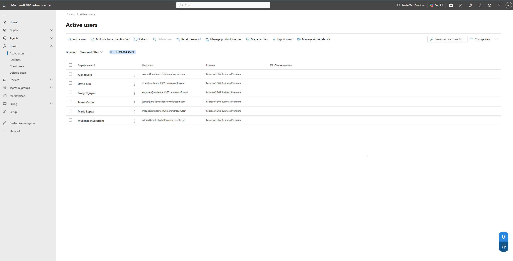

### User Profile

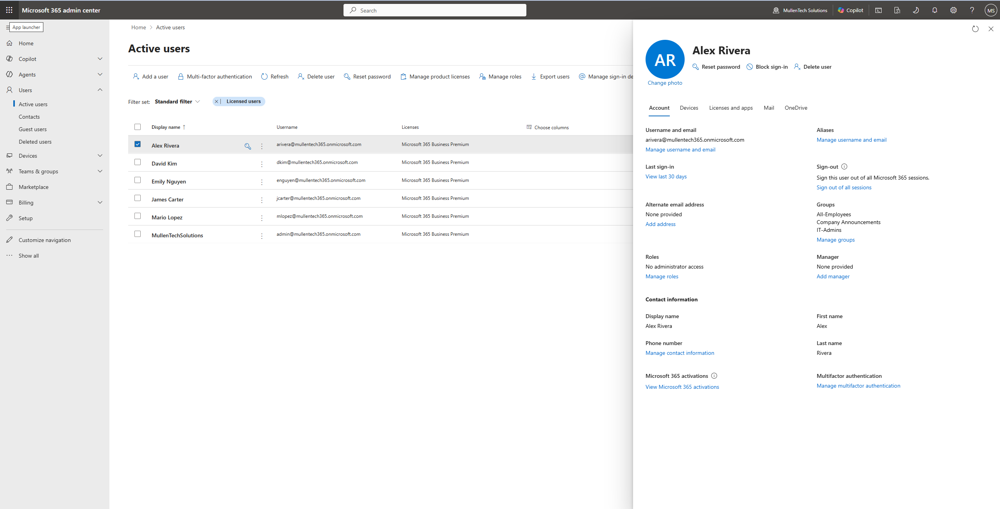

---

## 3. Group Management

Created Security Groups for access management and Microsoft 365 Groups for collaboration.

### Security Groups

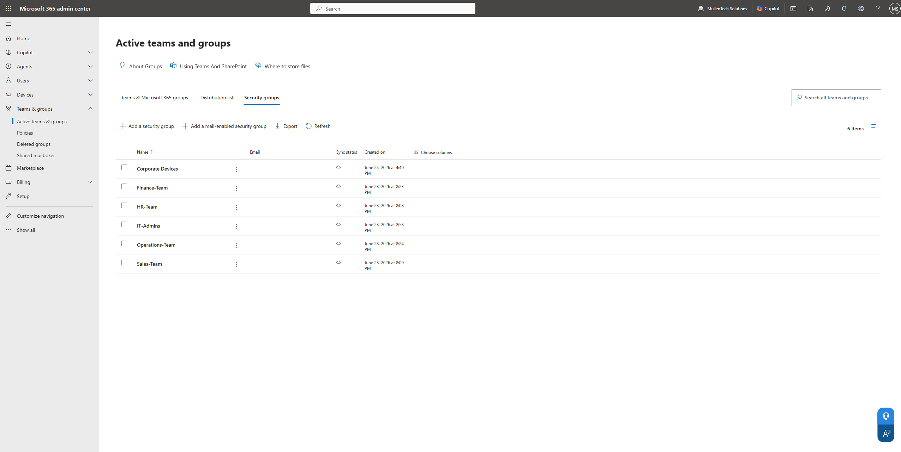

### Microsoft 365 Groups

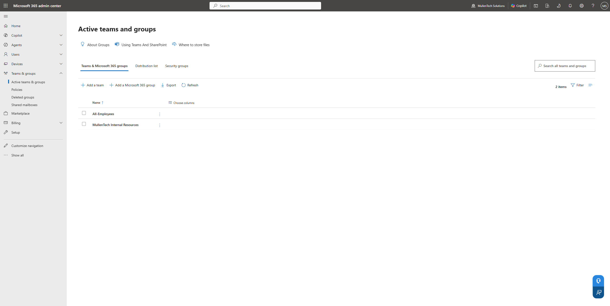

---

## 4. Exchange Online Administration

Configured shared mailboxes and distribution groups to support organizational communication.

### Shared Mailboxes

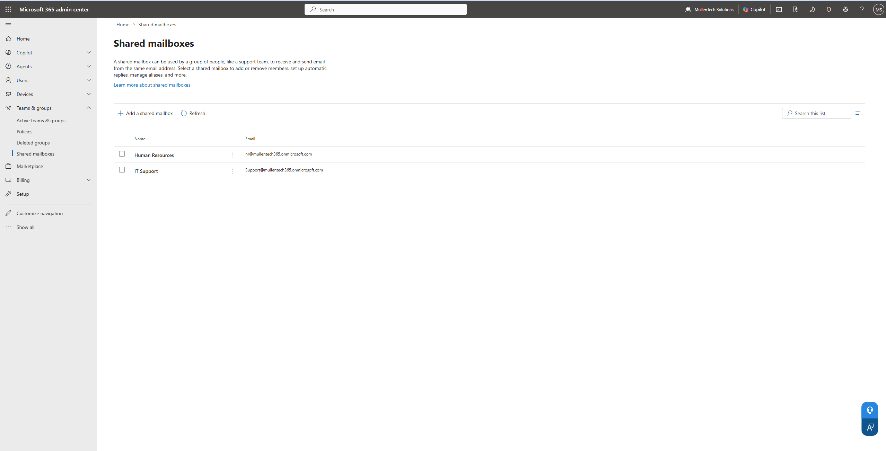

### Distribution Group

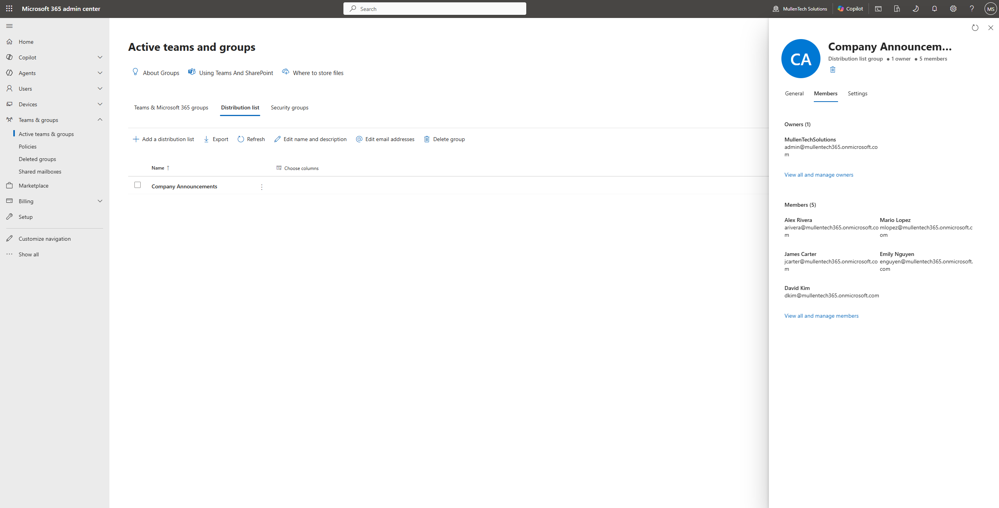
- Configured Microsoft Defender security requirements
- Implemented enterprise identity security best practices

---

## 5. Identity Security

Configured Microsoft Security Defaults and implemented a Conditional Access policy requiring Multi-Factor Authentication (MFA) for employee accounts.

### Security Defaults

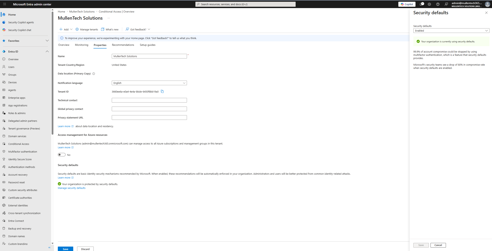

### Conditional Access

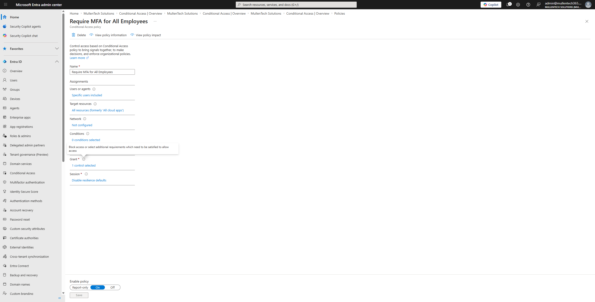

---

## 6. User Lifecycle Management

Performed a simulated employee offboarding by blocking user sign-in, removing Microsoft 365 licensing, and revoking organizational access.

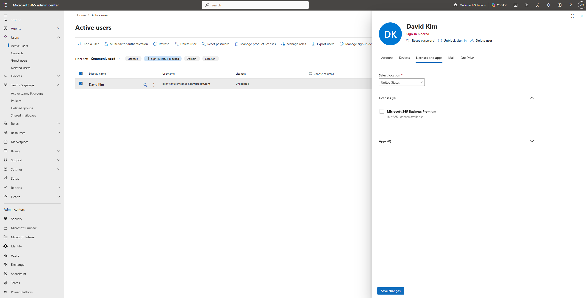

---

## 7. SharePoint Online Administration

Created a SharePoint Team Site to simulate centralized document management for organizational departments.

### Team Site

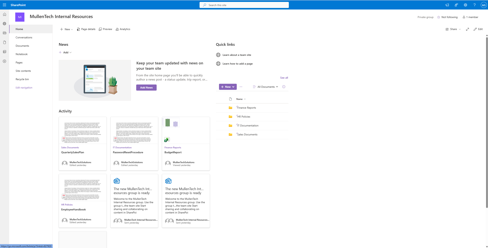

### Permission Management

Configured SharePoint document permissions to provide department-specific access.

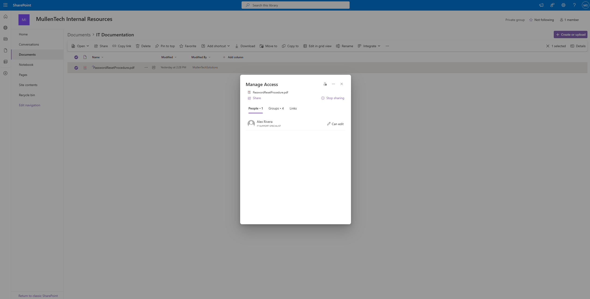

---

## 8. OneDrive Administration

Configured secure document sharing between users by assigning edit permissions through OneDrive.

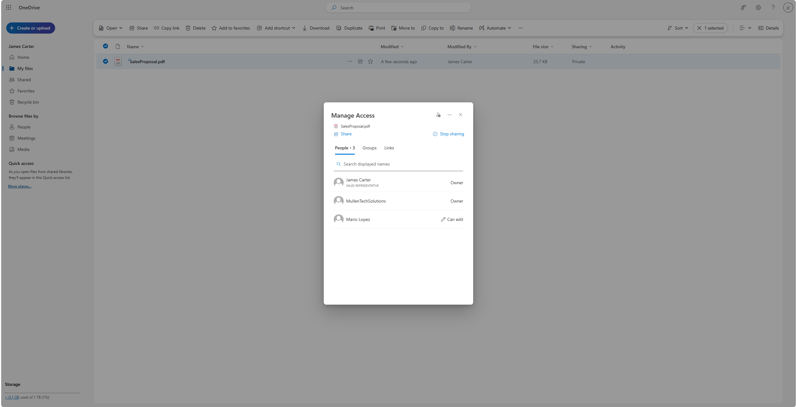

---

## 9. Microsoft Intune

Configured Microsoft Intune to manage organizational security policies and Windows device settings.

### Intune Dashboard

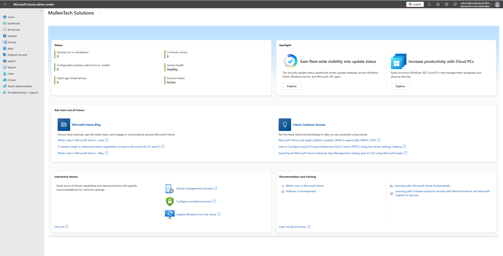

### Compliance Policy

Created a Windows compliance policy enforcing BitLocker, Secure Boot, TPM, Microsoft Defender Antivirus, password requirements, and assigned the policy to the **Corporate Devices** security group.

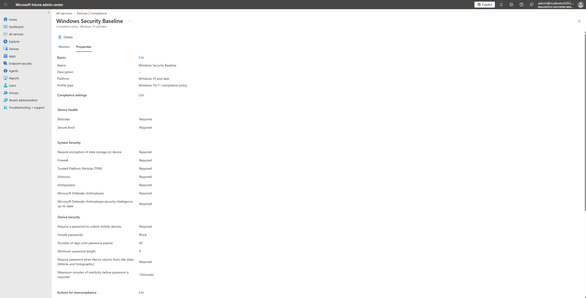

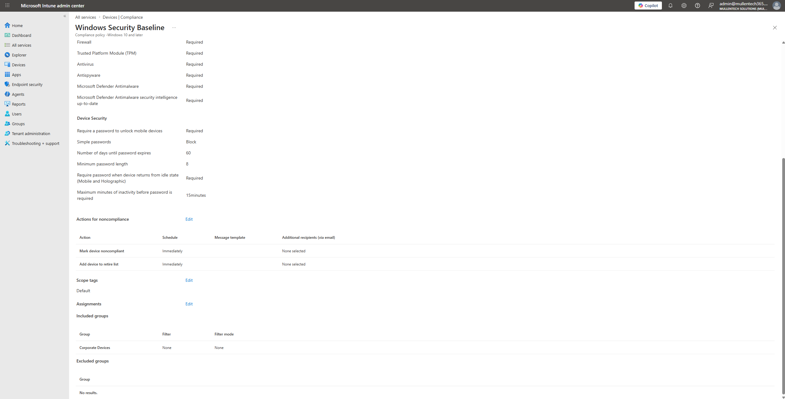

### Configuration Profile

Created a Windows configuration profile to standardize enterprise device settings and improve endpoint security.

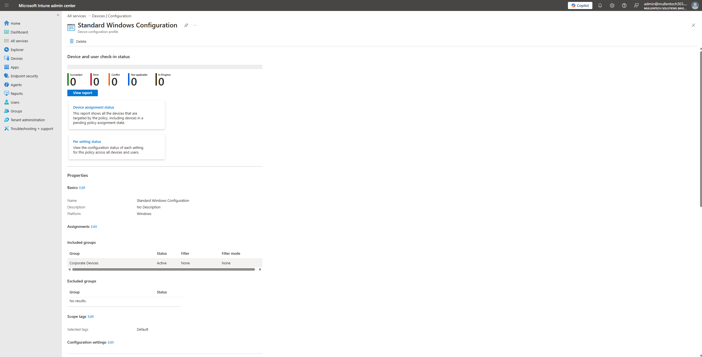

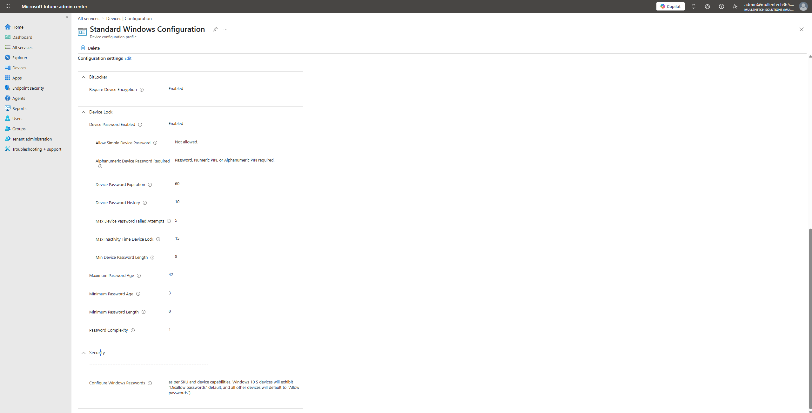
---

# Lessons Learned

Through this project, I gained practical experience administering Microsoft 365 services within a simulated enterprise environment. I developed a deeper understanding of identity management, cloud security, user lifecycle management, collaboration services, and endpoint administration using Microsoft 365 Business Premium.

Key concepts reinforced throughout the project included:

- Microsoft Entra ID user and group administration
- Microsoft Exchange Online mailbox management
- SharePoint Online document management and permissions
- OneDrive collaboration and secure file sharing
- Microsoft Intune compliance policies and configuration profiles
- Multi-Factor Authentication (MFA)
- Conditional Access policy implementation
- Microsoft Security Defaults
- User onboarding and offboarding processes
- Identity and Access Management (IAM) best practices

---

# Real-World Tasks Simulated

This lab was designed around common responsibilities performed by Help Desk Technicians, Desktop Support Technicians, and Microsoft 365 Administrators.

Completed tasks included:

- Creating employee accounts
- Assigning Microsoft 365 licenses
- Resetting user passwords
- Managing Security Groups and Microsoft 365 Groups
- Creating Shared Mailboxes
- Configuring Distribution Groups
- Enabling Multi-Factor Authentication
- Implementing Conditional Access
- Performing employee offboarding
- Creating SharePoint Team Sites
- Configuring SharePoint permissions
- Managing OneDrive file sharing
- Creating Microsoft Intune Compliance Policies
- Creating Microsoft Intune Configuration Profiles

---

# Project Outcome

This project demonstrates hands-on administration of core Microsoft 365 services used in enterprise environments. It highlights practical experience with cloud identity management, collaboration platforms, messaging administration, security controls, and endpoint management while following common IT support workflows.

---

# Future Improvements

Potential future enhancements include:

- Windows Autopilot device provisioning
- Microsoft Defender for Endpoint
- Intune device enrollment
- Endpoint security policies
- Mobile device management (MDM)
- PowerShell automation for Microsoft 365 administration
